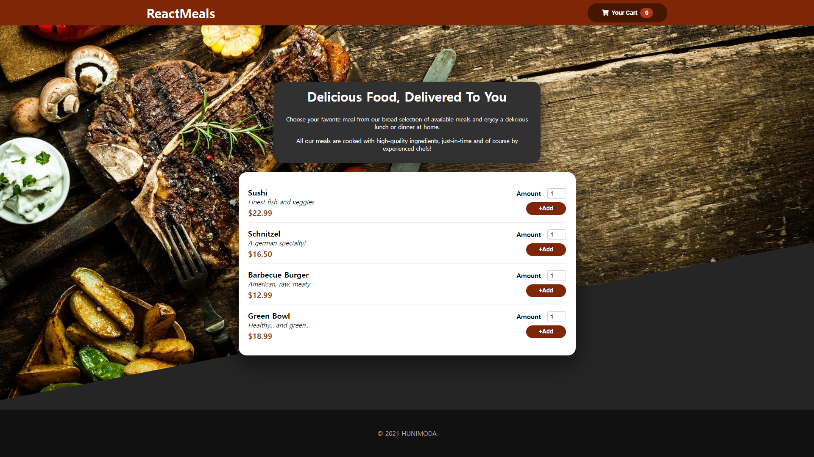
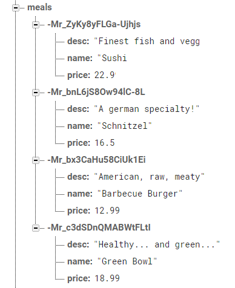
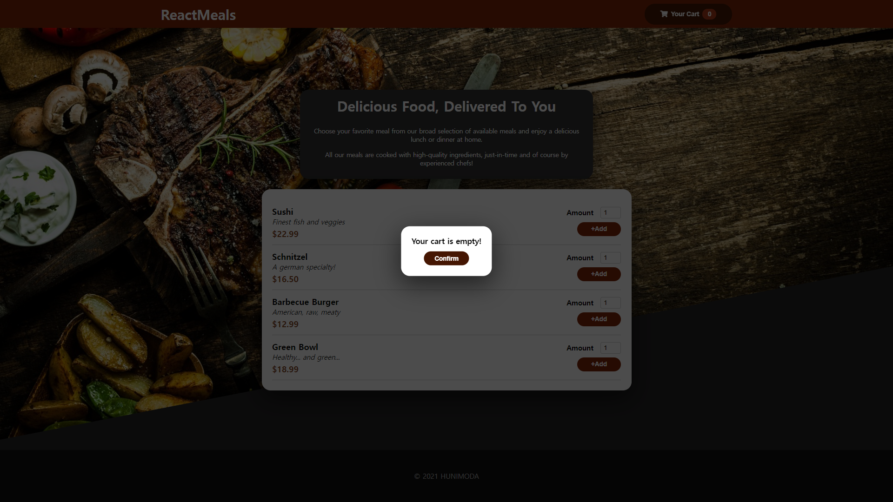
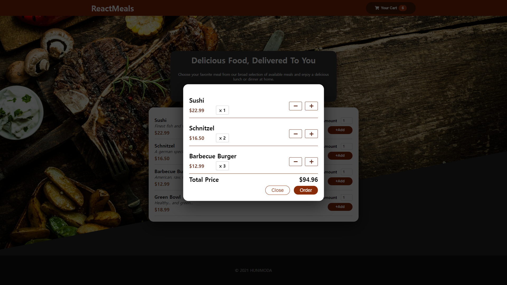
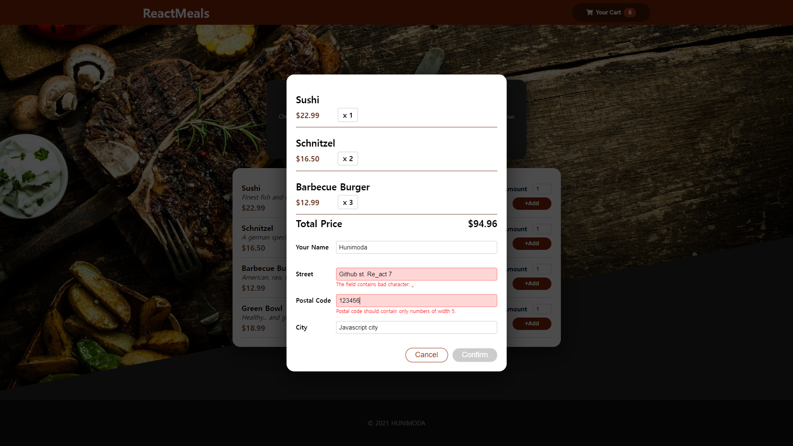

# 음식 주문 웹 어플리케이션

_
2021.12.15 ~
_
_
Hunimoda
_

- 설명

Udemy 리액트 강좌 **React - The Complete Guide** _(by Maximilian Schwarzmüller)_ 중 **Food Order App**의 클론 어플리케이션. 디자인은 해당 강좌 예시를 사용했고 모든 코드는 원본 코드를 참조하지 않고 필자가 작성했다. 아래는 어플리케이션이 로드된 화면.

_
[1] 어플리케이션이 로드된 화면
_

- 기능

  - Fetch API를 활용한 벡엔드 통신

  어플리케이션이 로드된 후 firebase로부터 메뉴의 정보를 읽어온다. 메뉴가 로딩되는 동안 loading spinner가 나타나고 응답을 성공적으로 수신하면 메뉴의 정보가 화면에 뜬다. +Add 버튼을 클릭하면 장바구니에 해당 메뉴가 담기고 상단의 장바구니 버튼을 클릭하여 주문할 수 있다. 몇 가지 항목에 구매자 정보를 기입하고 주문하면 주문 정보가 다시 fetch api를 통해 firebase로 전송된다.

_
[2] Firebase로 동작하는 backend
_

- 간단한 형태의 modal 구현

장바구니가 비어있거나 fetch api를 활용한 통신 과정에서 문제가 발생하는 등 각종 에러 상황에서 사용자에게 문제 상황을 설명하는 에러 modal을 구현했다. 또한 장바구니에 담긴 음식을 주문하는 창도 modal을 활용하여 구현했다. modal의 종류에 따라 backdrop을 클릭했을 때도 창을 닫을 수 있도록 했다.

_
[3] 장바구니가 비어있을 때
_

_
[4] 장바구니가 비어있지 않을 때
_

- 커스텀 훅을 이용한 입력값 검증

장바구니에 담긴 음식을 주문하는 form에서 각 input에 올바른 값이 입력됐는지 검증하는 커스텀 훅을 구현했다. 검증 알고리즘은 훅의 외부에서 설정할 수 있으며 올바르지 않은 값이 입력될 경우 그 내용을 화면에 표시하고 스타일링을 통해 해당 input을 강조 표시한다.

_
[5] 입력값 검증
_

- 몇 가지 CSS 애니메이션

처음 페이지가 로딩되고 메뉴가 표시될 때 리스트가 선명해지면서 부유하는 애니메이션과 리스트에서 음식을 추가할 때마다 장바구니 버튼이 'jerk'하는 애니메이션을 포함했다. Jerk 애니메이션은 useEffect, setTimeout/clearTimeout 함수를 사용하여 컴포넌트에 클래스를 추가하고 일정 시간이 경과하면 다시 제거하는 식으로 구현했다.
